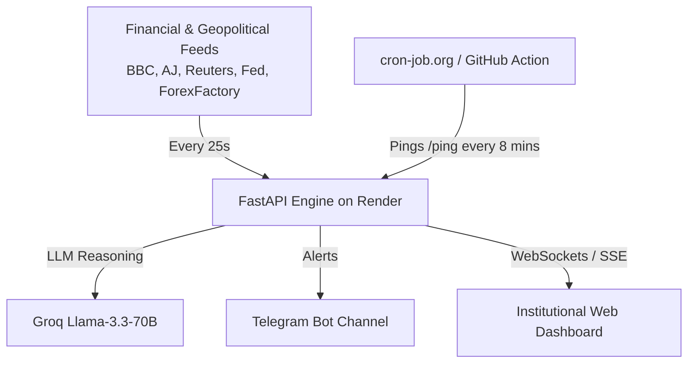

# Comprehensive Cloud Deployment Guide: Render + GitHub + Cron-Job Keepalive

This guide walks you step-by-step through deploying your **XAU/USD Geopolitical & Macro Intelligence System** to the cloud on **Render**, connected to **GitHub**, with an automated **Cron Job** to keep your background poller and live streams running 24/7 without sleeping.

---

## Architecture Overview



---

## Step 1: Push Your Code to GitHub

### 1.1 Initialize Git in the Project Directory
Open PowerShell or your terminal in `c:\Users\farha\Documents\xauusd1`:
```powershell
git init
git add .
git commit -m "feat: complete real-time XAU/USD geopolitical & macro intelligence system"
```

### 1.2 Create a New GitHub Repository
1. Go to [github.com/new](https://github.com/new).
2. Set the repository name (e.g. `xauusd-intelligence-engine`).
3. Choose **Public** or **Private**.
4. Leave "Initialize this repository with a README" **unchecked** (we already have our files).
5. Click **Create repository**.

### 1.3 Push to GitHub
Copy the commands shown on GitHub:
```powershell
git branch -M main
git remote add origin https://github.com/<YOUR-USERNAME>/xauusd-intelligence-engine.git
git push -u origin main
```

---

## Step 2: Deploy on Render

Render is a modern cloud hosting platform with automatic GitHub continuous deployment.

### Method A: Automated Deployment via Blueprint (Recommended)
1. Sign in or sign up at [render.com](https://render.com).
2. In your Render Dashboard, click **New +** → **Blueprint**.
3. Connect your GitHub repository: `xauusd-intelligence-engine`.
4. Render will automatically detect [`render.yaml`](file:///c:/Users/farha/Documents/xauusd1/render.yaml) and configure:
   - **Service Type**: Web Service
   - **Runtime**: Python
   - **Build Command**: `pip install -r requirements.txt`
   - **Start Command**: `uvicorn app:app --host 0.0.0.0 --port $PORT`
5. Click **Apply**.

---

### Method B: Manual Web Service Setup
If you prefer creating the service manually:
1. On the Render Dashboard, click **New +** → **Web Service**.
2. Select **Build and deploy from a Git repository** and pick your repo.
3. Configure the fields:
   - **Name**: `xauusd-intelligence`
   - **Region**: Oregon (US West) or Frankfurt (EU)
   - **Branch**: `main`
   - **Runtime**: `Python 3`
   - **Build Command**: `pip install -r requirements.txt`
   - **Start Command**: `uvicorn app:app --host 0.0.0.0 --port $PORT`
   - **Instance Type**: `Free`

### 2.2 Configure Environment Variables
In your Render Service Dashboard, navigate to **Environment**:
Add the following keys:

| Key | Value | Notes |
|---|---|---|
| `GEMINI_API_KEY` | `AQ...` or `AIzaSy...` | **Priority 1**: Google AI Studio API key. Auto-discovers and cascades across `gemini-3.6-flash`, `gemini-3.5-flash-lite`, `gemini-3.1-flash-lite`, `gemini-flash-lite-latest` |
| `GEMINI_MODEL` | *(Optional)* | Custom Gemini model override (e.g. `gemini-3.5-flash-lite`) |
| `OPENROUTER_API_KEY` | `sk-or-v1-...` | **Priority 2**: OpenRouter API key. Auto-discovers free `:free` models (`ling-3.0-flash-fin:free`, `nemotron-3.5-lightning:free`, `lfm-2.5:free`) |
| `OPENROUTER_MODEL` | *(Optional)* | Custom OpenRouter model override |
| `GROQ_API_KEY` | `gsk_...` | **Priority 3**: Groq Cloud key for ultra-fast LPU inference (`openai/gpt-oss-20b`, `qwen/qwen3.8-27b`, `groq/compound-mini`) |
| `GROQ_MODEL` | *(Optional)* | Custom Groq model override |
| `OPENAI_API_KEY` | `sk-...` | **Priority 4**: (Optional) OpenAI API key for `gpt-4o-mini`, `gpt-4o` |
| `TELEGRAM_BOT_TOKEN` | `123456:ABC...` | (Optional) Telegram bot token from `@BotFather` |
| `TELEGRAM_CHAT_ID` | `-100...` or `@channel` | (Optional) Telegram channel or group ID |
| `TELEGRAM_NOTIFY_ALL_EVENTS` | `true` | Set to `true` to receive Telegram alerts for 100% of events (CRITICAL, HIGH, MEDIUM, LOW) |

> [!TIP]
> **Strict Cascading Priority Architecture**:
> 1. **Google Gemini** (Priority 1: `gemini-3.6-flash`, `gemini-3.5-flash-lite`, `gemini-3.1-flash-lite`, `gemini-flash-lite-latest`)
> 2. **OpenRouter** (Priority 2: Permanent free community models: `inclusionai/ling-3.0-flash-fin:free`, `nvidia/nemotron-3.5-lightning:free`, `liquid/lfm-2.5-2.6b:free`)
> 3. **Groq Cloud** (Priority 3: Ultra-fast LPU inference: `openai/gpt-oss-20b`, `qwen/qwen3.8-27b`, `groq/compound-mini`)
> 4. **OpenAI** (Priority 4: `gpt-4o-mini`, `gpt-4o`)
> 5. **Deterministic Quantitative Macro Heuristic Engine** (Priority 5: Guaranteed zero-drop fail-open: $r = y - \pi$ real interest rates, safe-haven flight, DXY debasement).
>
> On startup and at runtime, the engine dynamically fetches the running available models from the provider APIs in real time, so you never encounter 404 deprecated model errors!
> Even if all external API keys expire or hit rate limits, the system fails open to the local quant heuristics and **never drops events or crashes**.

### How to Get Free AI API Keys:
1. **Groq (Fastest)**:
   - Go to [console.groq.com](https://console.groq.com) → Sign up with Google/GitHub → Click **API Keys** → **Create API Key**.
   - Copy key starting with `gsk_...`.
2. **Google Gemini (Most Generous Free Limits)**:
   - Go to [aistudio.google.com/app/apikey](https://aistudio.google.com/app/apikey) → Log in with Google → Click **Create API Key**.
   - Copy key starting with `AIzaSy...`.
3. **OpenRouter (Free Community Models)**:
   - Go to [openrouter.ai](https://openrouter.ai) → Sign up → Go to [openrouter.ai/keys](https://openrouter.ai/keys) → Click **Create Key**.
   - Copy key starting with `sk-or-v1-...`. Free models with `:free` suffix cost `$0.00`.

Click **Save Changes**. Render will automatically build and deploy your app. Once deployed, Render will provide a public URL:
`https://xauusd-intelligence.onrender.com`

---

## Step 3: Set Up 24/7 Keep-Alive Cron Job (Prevent Inactivity Sleep)

> [!IMPORTANT]
> Render's **Free Tier** automatically suspends web instances after **15 minutes** of zero incoming HTTP requests.
> To ensure your background poller never sleeps and continues ingesting breaking geopolitical news 24/7, set up an automated free cron job to ping the keep-alive endpoint.

### Option A: Using cron-job.org (Free & Takes 2 Minutes)
1. Register a free account at [cron-job.org](https://cron-job.org).
2. Go to **Cronjobs** → **Create Cronjob**.
3. Configure:
   - **Title**: `XAUUSD Keepalive Ping`
   - **URL**: `https://your-app-name.onrender.com/ping` (or `/healthz`)
   - **Execution Schedule**: **Every 9 minutes** (or `*/9 * * * *`)
   - **Request Method**: `GET`
   - **Notifications**: Enable failure alerts if desired
4. Click **Create**.
5. Your service will now receive an HTTP request every 9 minutes, preventing it from ever spinning down.

---

### Option B: Using GitHub Actions Keep-Alive Workflow
We have included a ready-to-use GitHub Action workflow in [`.github/workflows/keepalive.yml`](file:///c:/Users/farha/Documents/xauusd1/.github/workflows/keepalive.yml).

1. In your GitHub repository, go to **Settings** → **Secrets and variables** → **Actions**.
2. Add a **New repository secret**:
   - Name: `RENDER_APP_URL`
   - Value: `https://your-app-name.onrender.com/ping`
3. The GitHub Action will automatically run on a schedule every 10 minutes to ping your Render application and verify that it is healthy!

---

## Step 4: Verification & Live Health Checks

Once deployed, you can verify your service via:

1. **Web Dashboard**:
   Visit `https://your-app-name.onrender.com` in your browser.
   - Confirm the green **WEBSOCKET ACTIVE** / **SSE ACTIVE** badge is glowing.
   - Confirm the live XAU/USD spot price is ticking.
   - Confirm the countdown timer is syncing every 25 seconds.

2. **Ultra-Fast Health Probe**:
   ```bash
   curl https://your-app-name.onrender.com/ping
   # Output: pong
   ```

3. **Detailed Quant Status**:
   ```bash
   curl https://your-app-name.onrender.com/healthz
   ```
   Returns JSON with poller status, total events parsed, active subscribers, and configured LLM providers.
